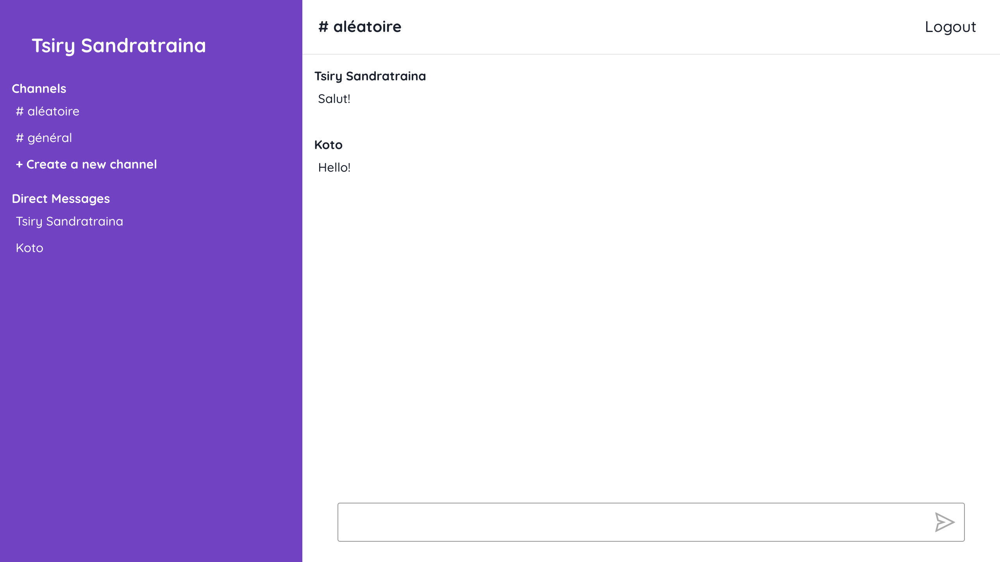

<h1 align="left">Slack Clone </h1>
<p>
  <a href="#" target="_blank">
    
  </a>
</p>

> Slack-Clone is a clone of slack. Implemented using React, Prisma and GraphQL.
## Preview




## Install

Create a .env file from the .env.example:

```sh
cp .env.example .env && cp graphql/.env.example graphql/.env && cp web/.env.example web/.env && cp web/.env.example web/.env.local
```

Start the server:

```sh
docker-compose up
```

Start the client :
```sh
cd web && yarn install && yarn start
```
## Author

👤 **Tsiry Sandratraina**

* Github: [@tsirysndr](https://github.com/tsirysndr)

## 🤝 Contributing

Contributions, issues and feature requests are welcome!<br />Feel free to check [issues page](https://github.com/tsirysndr/slack-clone/issues). 

## Show your support

Give a ⭐️ if this project helped you!
